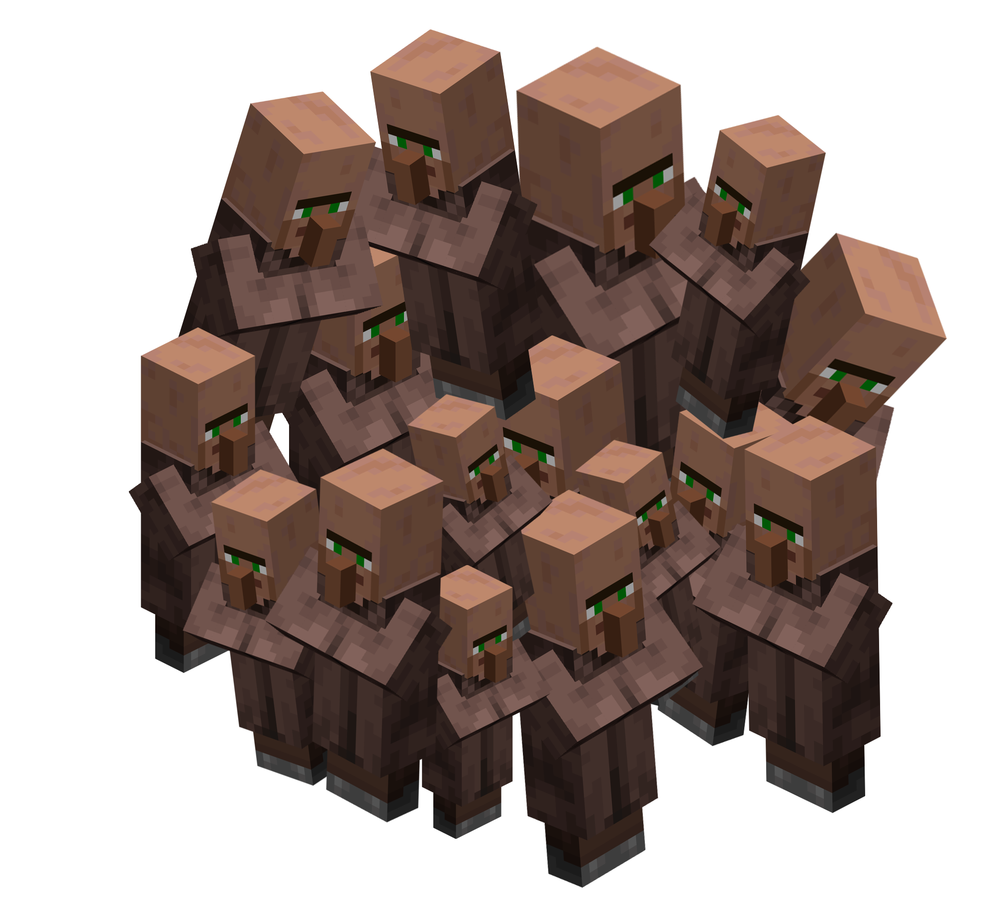

# Loud typing

Make random noises when you type

<div style="text-align:center">
    
</div>

## Installation

*Note: only tested working on linux*

```
$ git clone https://github.com/D3faIt/loud-typing.git
$ cd loud-typing
$ cargo build --release
```

The executable is now located in `./target/release/loud-typing`

### Wayland

Please use the `evdev` branch for wayland. Tested working on KDE Plasma. Does not work on Sway for some reason

## Usage

```bash
$ loud-typing [OPTIONS] [INPUT]...
```

Optional arguments `[INPUT]...` to set one or multiple directories containing one or multiple audio files or set one or multiple audio files.

If nothing is provided, it will try the `sounds/minecraft/villagers` directory 

| Options                | type  | default | Description                                     |
|------------------------|-------|---------|-------------------------------------------------|
| -r / --random          | bool  | false   | Play sounds in random order                     |
| -p / --pitch           | bool  | false   | Play sounds with a random pitch                 |
| -d / --pitch-deviation | float | 0.2     | Set the amount of pitch deviation from 0 - 0.99 |
| -h / --help            | bool  | false   | Print help                                      |
| -v / --version         | bool  | false   | Print version                                   |

### Example

Play audio files in the `sounds/minecraft/villagers` directory mapped to all keys (not random).
```bash
$ loud-typing
```

Play random audio files in the `sounds/minecraft/villagers` directory.
```bash
$ loud-typing -r
```

Play audio files in the `sounds/minecraft/villagers` directory mapped to all keys (not random), with a pitch deviation of 0.2
```bash
$ loud-typing -p -d 0.2
```

Play audio files in the `sounds/hits` directory mapped to all keys (not random), with a pitch deviation of 0.3
```bash
$ loud-typing -p -d 0.3 sounds/hits
```

Play random audio file in the `sounds/hits` directory with pitch deviation of 0.5
```bash
$ loud-typing -rp -d 0.5 sounds/hits
```

